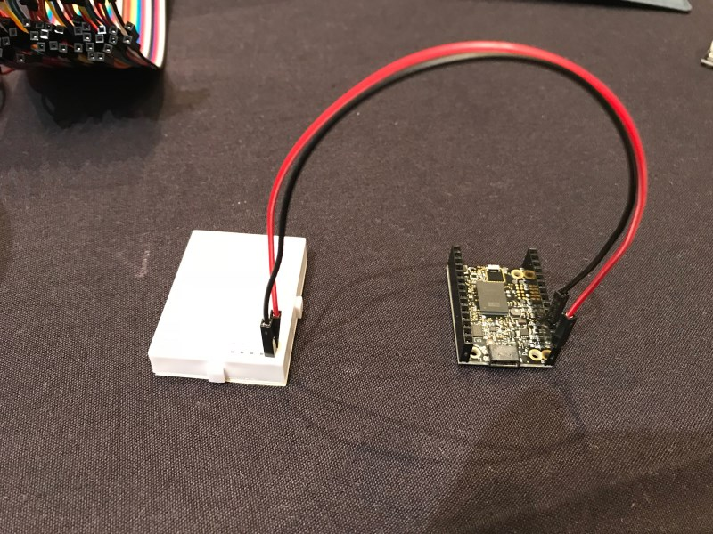
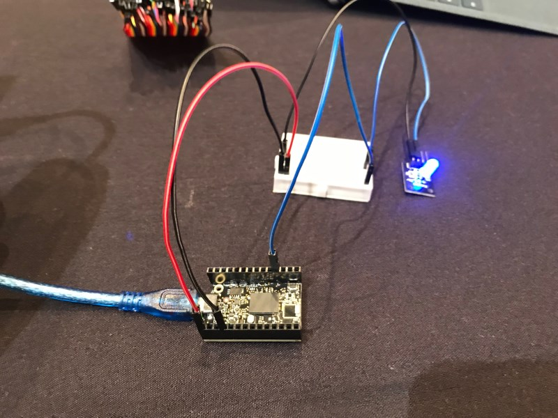
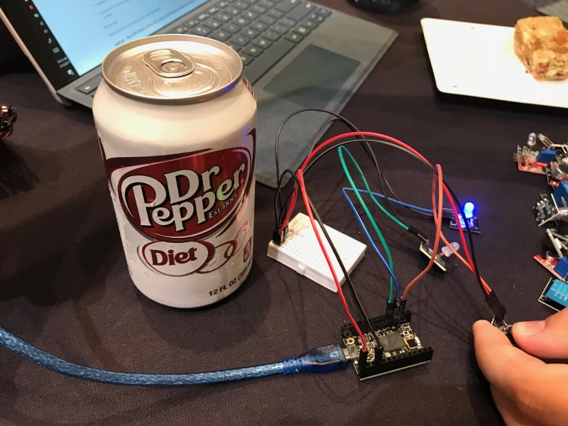

# Airlock - TinyTILE

## Installation

```
go get -d -u gobot.io/x/gobot/...
```

## Connecting the TinyTILE to your computer

Plug the TinyTILE into your computer using the blue USB cable provided in your starter kit. The Firmata firmware that we use for controlling the TinyTILE from your computer has already been flashed onto the TinyTILE board.

## Running the code
When you run any of these examples, you will compile and execute the code on your computer.

To compile/run the code:

```
$ go run step1.go /dev/ttyACM0
```

If using Mac OS X then the TinyTILE will probably use a device name like `/dev/tty.usbmodem1421`. Perform a directory listing of `/dev/`; the TinyTILE is likely a device named using the pattern `/dev/tty.usbmodem`.

Substitute the name of the program and the name of your serial port as needed.

The Gobot program will use the serial interface to communicate with the connected TinyTILE that is running the Firmata firmware. Your TinyTILE already has Firmata installed for you. If you need to reload Firmata on your TinyTILE you can use Gort (http://gort.io)

## Code



First connect the power on the TinyTILE to the breadboard as follows:

- Connect the GND pin on the TinyTILE to the breadboard's very bottom row using a black jumper cable. We will refer to this row of pins as the "GROUND RAIL".

- Connect the 5V power pin on the TinyTILE to the breadboard's second row from the bottom using a red jumper cable. We will refer to this row of pins as the "POWER RAIL".

On a breadboard, all of the pins in a horizontal row are connected to each other. So when we have a wire connected to one pin in that row, if we connect another in that same row, then both are connected to each other.

### step1.go - Blue LED



- Plug the RGB LED's blue pin "B" to the first row of pins on the breadboard on the right. Plug the RGB LED's ground pin "-" to the GROUND RAIL on the breadboard very bottom right.

- Connect pin 3 on the TinyTILE to the same first row of pins on the breadboard next to the blue LED's pin. Choose any color of cable besides red or black.

- Discover what tty is being used by your connection: `ls /dev/tty.*`

Run the code.

You should see the blue LED blink.

### step2.go - Blue LED, Button


- Connect the button to the breadboard so one side connects to pins 7 and 9 on one side of the gap, and connects to pins 7 and 9 on the other side of the gap.

- Connect a red jumper cable from the power rail (+) on the breadboard to pin 7 on the breadboard.

- Connect a 10K Ohm resistor from pin 9 on the breadboard to pin 11 on the breadboard.

- Connect a black jumper cable from the ground rail (-) on the breadboard to pin 23 on the breadboard.

- Connect pin 8 on the TinyTILE to pin 9 on the breadboard on the opposite side. Choose any color of cable besides red or black.

Run the code.

When you press the button, the blue LED should turn on.

### step3.go - Blue LED, Button, Green LED



- Plug a green LED to pin 13 and pin 14 on the breadboard. Make sure the longer pin of the LED is plugged into pin 13.

- Connect pin 4 on the TinyTILE to pin 13 on the breadboard. Choose any color of cable besides red or black.

- Connect pin 14 on the breadboard to the breadboard's blue ground rail (-) using a black jumper cable.

Run the code.

The green LED should light up. When you press the button, the blue LED should turn on, and the green LED should turn off.

### step4.go - Blue LED, Button, Green LED, Gobot API

This step has us playing with the Gobot API. No additional hardware needs to be connected.

Run the code.

You can now point your web browser to `http://localhost:3000` and try out the [Robeaux](https://github.com/hybridgroup/robeaux) web interface.

### step5.go - Blue LED, Button, Green LED, Gobot API, Buzzer, Additional Button


- Connect the buzzer to pin 16 on both sides of the breadboard. Make sure the plus (+) is on the left side.

- Connect pin 16 on the right side of the breadboard to the ground rail (-) on the breadboard.

- Connect pin 7 on the TinyTILE to pin 16 on the left side of the breadboard.

- Connect the touch sensor to the breadboard so one side connects to pins 19 and 21 on one side of the gap, and connects to pins 19 and 21 on the other side of the gap.

- Connect a red jumper cable from the power rail (+) on the breadboard to pin 19 on the breadboard.

- Connect a 10K Ohm resistor from pin 21 on the breadboard to pin 23 on the breadboard.

- Connect a black jumper cable from the ground rail (-) on the breadboard to pin 23 on the breadboard.

- Connect pin 8 on the TinyTILE to pin 21 on the breadboard on the opposite side. Choose any color of cable besides red or black.

Run the code.

When you press the second button, the buzzer should sound.

### step6.go - Blue LED, Button, Green LED, Cylon.js API, Buzzer, Additional Button, Photoresistor


- Connect the Photoresistor to pin 26 on the breadboard and the power rail (+) on the breadboard.

- Connect a 10K Ohm resistor from pin 26 on the breadboard to the ground rail (-) on the breadboard.

- Connect pin A0 on the TinyTILE to pin 26 on the breadboard. Choose any color of cable besides red or black.

Run the code.

Changing the light level will display the current analog reading on your console.

## License

Copyright (c) 2015-2017 The Hybrid Group. Licensed under the MIT license.
