# Gobot Starter Kit 2017

The starter kit for the Gophercon 2017 Community Day!

## Intel TinyTILE

The Intel TinyTILE is a small 3.3 volt microcontroller based on the Intel Curie System on Chip (SoC). It is Arduino-compatible, and also has a built-in 6-axis accelerometer, Bluetooth LE radio, and even a small neural net processor.

For info on Gobot support for the Intel Curie based boards (TinyTILE and Arduino 101) go to:

[https://gobot.io/documentation/platforms/curie/](https://gobot.io/documentation/platforms/curie/)

## Sensor Kit

The Gobot Starter Kit includes 37 different small sensor or actuator boards. Some of them are variations of single sensor, but including some extra electronics for a specific use case, such as a digital threshold trigger.

### Sound Sensor


This module can produce an analog signal to measure the sound threshold detected by the small microphone. This is not a good enough mic to actually record sound.

In addition, the module sends a digital trigger, similar to how a button triggers when sound is detected. The threshold can be set using the small screw on the blue box.

### Light Sensor


This module can produce an analog signal to measure the light level using  a small photo luminescence resistor.

### Magnetic Sensor - Digital


This module can produce an digital signal to detect the presence of a very near magnetic field.

### Magnetic Sensor - Analog


This module can produce an analog signal to detect how near or far away is the presence of a very near magnetic field.

### Red/Green LED - Small


This module is a combination red and greed LED.

"-" symbol is the ground pin, the middle pin is the positive for green and the end labeled "s" is the positive pin for red.

### Red/Green LED - Large


This module is another larger combination red and greed LED.

"-" symbol is the ground pin, the middle pin is the positive for green and the end labeled "s" is the positive pin for red.

### Temperature Sensor


This module can produce an analog signal to measure the ambient temperature.

The ground pin is on the "-" symbol. The 5V is the center pin, and signal is an analog voltage on the "s" labeled pin. You will need to convert this voltage to determine the correct temperature from the voltage.

### Magnetic Sensor - Module


This module can produce an analog signal to detect how near or far away is the presence of a very near magnetic field.

In addition, the module sends a digital trigger, similar to how a button triggers when a magnet is detected. The threshold can be set using the small screw on the blue box.

There is a red led included on the board which turns on when magnet is detected. The "A0" is the analog signal pin, "G" is ground ", "+" is 5v positive, and "D0" digital trigger pin for this module.

### Temperature Sensor - Module

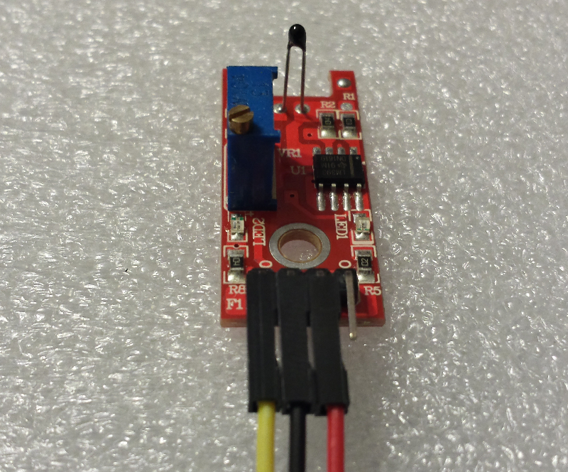

This module can produce an analog signal to measure the ambient temperature. You will need to convert the analog voltage to determine the correct temperature from the voltage.

In addition, the module sends a digital trigger, similar to how a button triggers when a threshold of temperature is detected. The threshold can be set using the small screw on the blue box.

The "A0" is analog pin, "G" is ground pin, "+" is 5v positive pin, "D0" pin is the digital trigger pin for this module.

### Touch Sensor - Module


This module can produce an analog signal to measure when it is touched.

In addition, the module sends a digital trigger, similar to how a button triggers when touch is detected. The threshold can be set using the small screw on the blue box.

The "A0" pin is analog pin, "G" is ground pin, "+" is 5v positive pin, "D0" pin is the digital trigger pin.

### Magnetic Reed Module


This module can produce an analog signal to detect a magnet. It is known as a magnetic reed sensor.

In addition, the module sends a digital trigger, similar to how a button triggers when magnetic field is detected. The threshold can be set using the small screw on the blue box.

"A0" is analog signal pin, "G" is ground pin, "+" is 5v positive pin, "D0" pin is the digital trigger. There is also a built-in tiny red LED that signals when the magnet is near.

### RGB LED (flat)


This module is a small flat RGB LED. Note that the pins on this board are mis-labeled.

"-" symbol is ground pin, "R" symbol is GREEN positive pin, "G" symbol is RED positive pin, and "B" symbol is BLUE positive pin.

### Light Cup

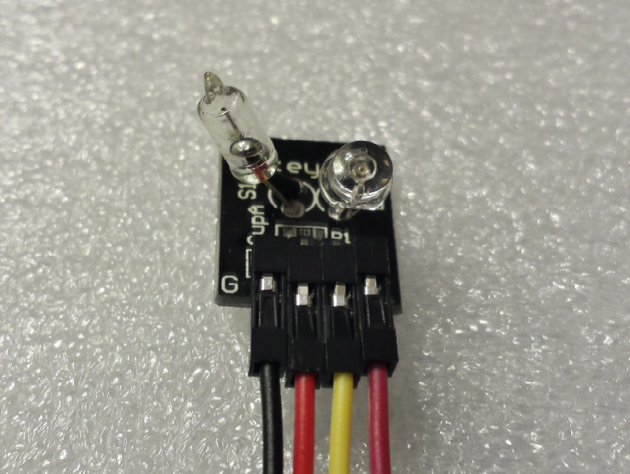

This module is a digital gravity powered mercury switch. Note that the LED on switch does not appear to work.

"G" is ground pin, "+" is 5v positive pin, "S" is digital signal, "L" is 5v led which appears not to work.

### Infrared Emission Sensor


This module is an analog/digital infrared sensor.

In addition, the module sends a digital trigger, similar to how a button triggers when IR is detected. The threshold can be set using the small screw on the blue box.

There is a small built-in 5v red signal LED included.

"A0" is the analog pin, "G" is ground pin, "+" is 5v positive pin, "D0" pin is the digital pin for this module.

### RGB LED


This module is a small RGB LED.

"-" symbol is ground pin, "G" symbol is GREEN positive pin, "R" symbol is red positive pin, and "B" symbol is blue positive pin.

### IR Sensor


This module is a IR light receiver such as that used by televisions.

"-" is negative pin, "s" pin is the digital signal pin, and the middle pin is 5v positive.

### Magnetic Reed Switch


digital magnetic reed switch "-" is negative, "s" pin is the digital signal pin and the middle pin is 5v positive

### Mercury Switch


digital murcury switch with red LED, "-" is negative, "s" pin is the digital signal pin and the middle pin is 5v positive, tilt the switch to trigger the signal and the LED also turns on

### Hit Sensor - Module
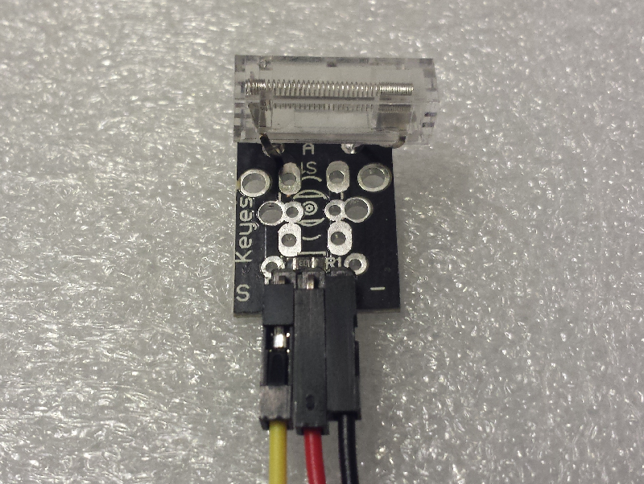

digital knock/hit sensor "-" is negative, "s" pin is the digital signal pin and the middle pin is 5v positive, the sensor is not sensitive must hit kinda hard to trigger

### Vibration Sensor
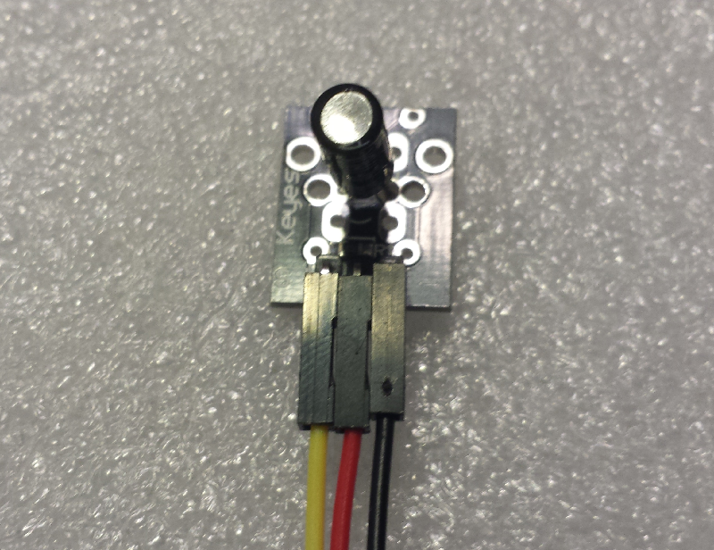

Digital Vibration sensor "-" is negative, "s" pin is the digital signal pin and the middle pin is 5v positive

### Tilt Sensor


digital tilt sensor "-" is negative, "s" pin is the digital signal pin and the middle pin is 5v positive

### Relay
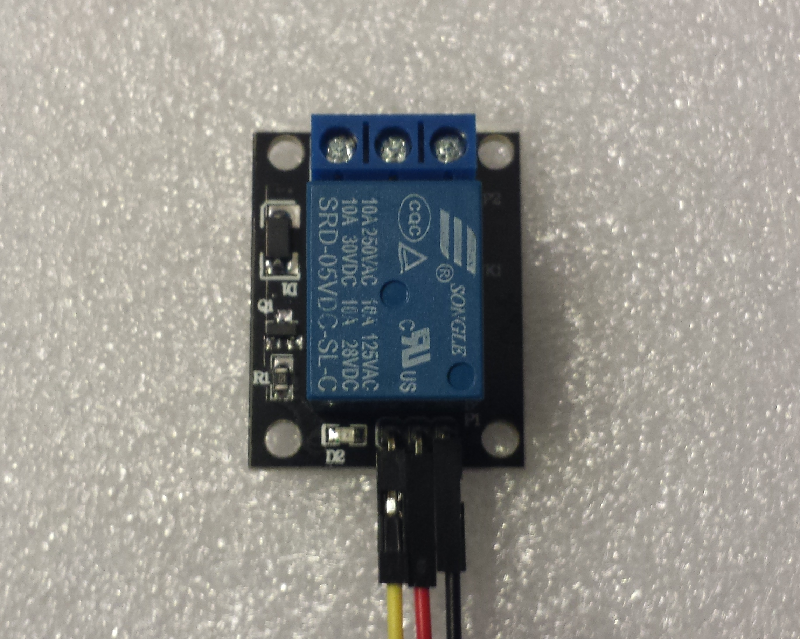

digital relay with red led to signal open / close... I couln't get the output to light an led properly may need to test more  "-" is negative, "s" pin is the digital signal pin and the middle pin is 5v positive

### Active Buzzer X2
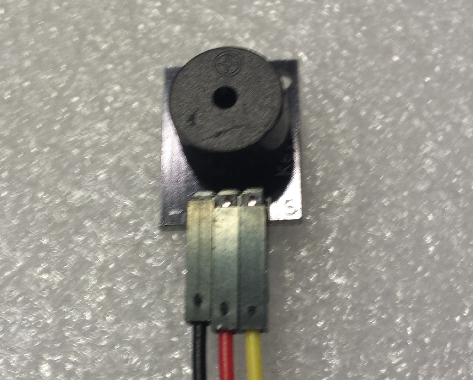

digital buzzer... one buzzer works correctly and the other buzzer "-" symbol == positive

### Push Button
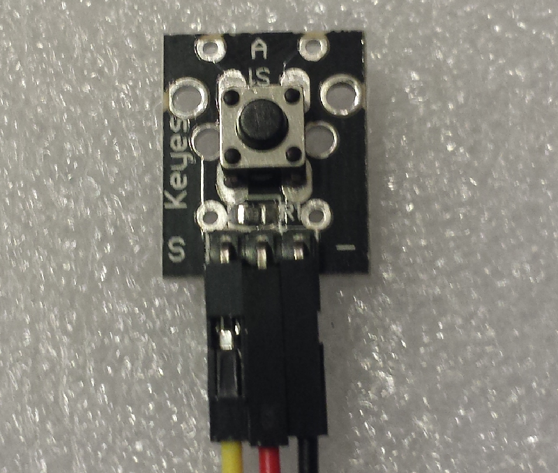

simple push putton two modes either pushed or not pushed "-" is negative, "s" pin is the digital signal pin and the middle pin is 5v positive

### Joystick
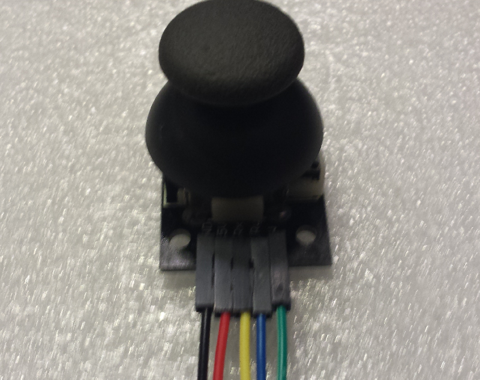

need to write a proper driver "gnd" is ground, "+5v" is 5v, "vrx" is x axis, "vry" is y axis, sw is presssing the button in

### Optical Break Sensor


not working atm with current tests

### Obstacle Avoidance Sensor 1


digital ir motion sensor "gnd" is ground, "+" is 5v out is digital  signal cable

### Line Finder


digital line finder follows black line, need small flathead to adjust the sensativity, "g" is ground, "v+" is 5v positive, "s" is digital signal cable

### Fingerprint Heartbeat Detector

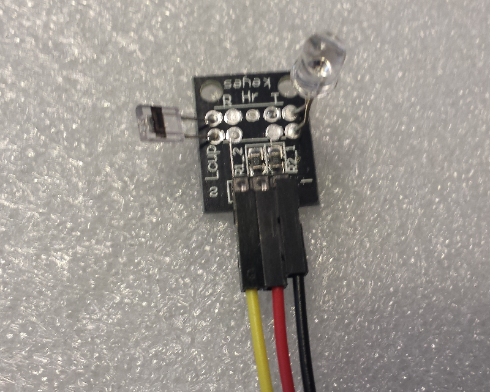

needs math to work correctly
this is what it looks like in arduino code

```
// Pulse Monitor Test Script

int sensorPin = 0;
double alpha = 0.75;
int period = 100;
double change = 0.0;
double minval = 0.0;
void setup ()
{
  Serial.begin (9600);
}
void loop ()
{
    static double oldValue = 0;
    static double oldChange = 0;

    int rawValue = analogRead (sensorPin);
    double value = alpha * oldValue + (1 - alpha) * rawValue;

    Serial.print (rawValue);
    Serial.print (",");
    Serial.println (value);
    oldValue = value;

    delay (period);
}
```

### Motion Sensor
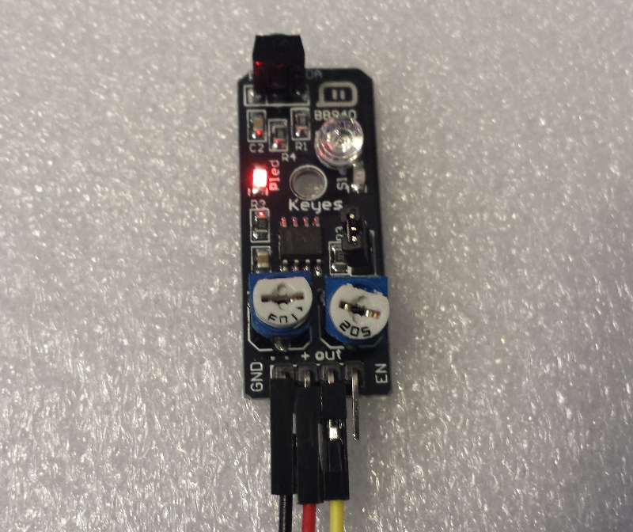

appears to be an ir motion detector

### LASER


digital red laser "-" is ground, middle wire is 5v positive, "s" is digital signal cable

### LED
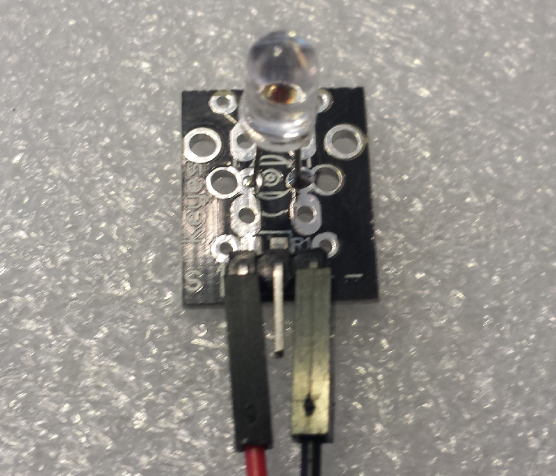

LED appears not to work may need resistor

### 1-Wire Temperature Sensor
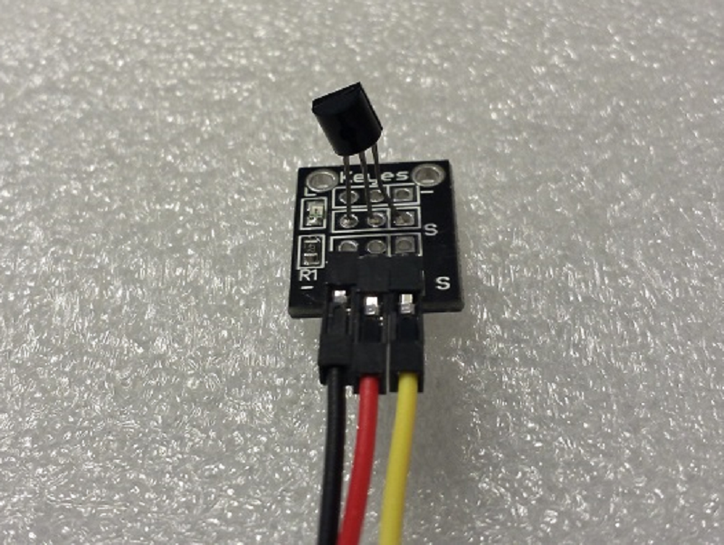

Not yet supported... help wanted! Ask us

### 1-Wire Temperature/Humidity Sensor


Not yet supported... help wanted! Ask us

### Rotary Encoder
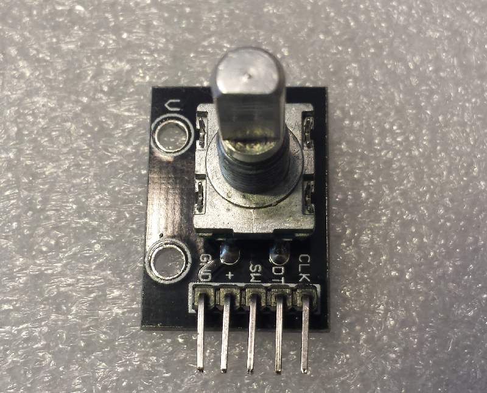

not yet supported... help wanted! Ask us
looking for pulse encoding support
