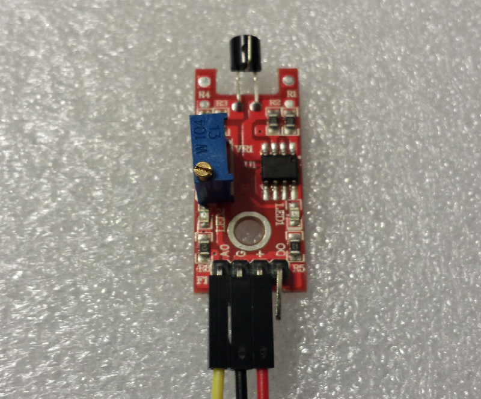

# Gobot Starter Kit 2017

The starter kit for the Gophercon 2017 Community Day!

## Intel TinyTILE

## Sensor Kit

### Sound Sensor

module that can be used with analog signal to measure sound threshold and/or with digital to detect if sound was made

### Light Sensor

analog photo luminescence resister module for detecting light

### Magnetic Sensor - Digital

digital module with an led to detect the presence of a magnetic field

### Magnetic Sensor - Analog

analog module that is sensative to how near or far a magnet is detected 

### Red/Green LED - Small

"-" symbol is the ground, middle pin is the posative for green and the end labeled "s" is the posative for the green

### Red/Green LED - Large

"-" symbol is the ground, middle pin is the posative for green and the end labeled "s" is the posative for the green

### Temperature Sensor

analog temperature sensor 5v module ground is on the "-" symbol 5v is the center pin,and signal is analog on the "s" labeled pin... Need to do proper math to get correct temperature

### Magnetic Sensor - Module

analog/digital magnetic feild module 5v red signal led included. A0 is anlog pin, "G" is ground ", "+" is 5v posative, D0 pin is the digital pin for this module

### Temperature Sensor - Module

analog/digital temperature sensor A0 is anlog pin, "G" is ground ", "+" is 5v posative, D0 pin is the digital pin for this module math needs work to get correct temp

### Touch Sensor - Module

analog/digital touch sensor A0 is anlog pin, "G" is ground ", "+" is 5v posative, D0 pin is the digital 

### Magnetic Reed Module

analog/digital magnetic reed sensor that open or close when exposed to a magnetic feild A0 is anlog pin, "G" is ground ", "+" is 5v posative, D0 pin is the digital red LED signals when magnet is near
 
### RGB LED (flat)

"-" symbol is ground, "R" symbol is green posative, "G" symbol is red posative, and "B" symbol is blue posative

### Light Cup

digital gravity powered mercury switch, LED on switch does not appear to work tried 4 different sensors to test "G" is ground ", "+" is 5v posative S is digital signal(works), " L" is 5v led which appears to not work

### Infrared Emission Sensor

analog/digital infrared sensor 5v red signal led included. A0 is anlog pin, "G" is ground ", "+" is 5v posative, D0 pin is the digital pin for this module 

### RGB LED

this one has the correct labeling yay! "-" symbol is ground, "G" symbol is green posative, "R" symbol is red posative, and "B" symbol is blue posative

### IR Sensor

digital infrared sensor "-" is negative, "s" pin is the digital signal pin and the middle pin is 5v positive

### Magnetic Reed Switch

digital magnetic reed switch "-" is negative, "s" pin is the digital signal pin and the middle pin is 5v positive

### Mercury Switch

digital murcury switch with red LED, "-" is negative, "s" pin is the digital signal pin and the middle pin is 5v positive, tilt the switch to trigger the signal and the LED also turns on

### Hit Sensor - Module

digital knock/hit sensor "-" is negative, "s" pin is the digital signal pin and the middle pin is 5v positive, the sensor is not sensitive must hit kinda hard to trigger

### Vibration Sensor

Digital Vibration sensor "-" is negative, "s" pin is the digital signal pin and the middle pin is 5v positive

### Tilt Sensor

digital tilt sensor "-" is negative, "s" pin is the digital signal pin and the middle pin is 5v positive

### Relay

digital relay with red led to signal open / close... I couln't get the output to light an led properly may need to test more  "-" is negative, "s" pin is the digital signal pin and the middle pin is 5v positive

### Active Buzzer X2

digital buzzer... one buzzer works correctly and the other buzzer "-" symbol == positive

### Push Button

simple push putton two modes either pushed or not pushed "-" is negative, "s" pin is the digital signal pin and the middle pin is 5v positive

### Joystick

need to write a proper driver "gnd" is ground, "+5v" is 5v, "vrx" is x axis, "vry" is y axis, sw is presssing the button in

### Optical Break Sensor

not working atm with current tests

### Obstacle Avoidance Sensor 1

digital ir motion sensor "gnd" is ground, "+" is 5v out is digital  signal cable

### Line Finder

digital line finder follows black line, need small flathead to adjust the sensativity, "g" is ground, "v+" is 5v positive, "s" is digital signal cable

### Fingerprint Heartbeat Detector

needs math to work correctly
this is what it looks like in arduino code

// Pulse Monitor Test Script
int sensorPin = 0;
double alpha = 0.75;
int period = 100;
double change = 0.0;
double minval = 0.0;
void setup ()
{
  Serial.begin (9600);
}
void loop ()
{
    static double oldValue = 0;
    static double oldChange = 0;
 
    int rawValue = analogRead (sensorPin);
    double value = alpha * oldValue + (1 - alpha) * rawValue;
 
    Serial.print (rawValue);
    Serial.print (",");
    Serial.println (value);
    oldValue = value;
 
    delay (period);
}

### Motion Sensor

???

### LASER

digital red laser "-" is ground, middle wire is 5v positive, "s" is digital signal cable

### LED

LED appears not to work

### 1-Wire Temperature Sensor

Not yet supported... help wanted! Ask us

### 1-Wire Temperature/Humidity Sensor

Not yet supported... help wanted! Ask us

### Rotary Encoder

not yet supported... help wanted! Ask us
looking for pulse encoding support